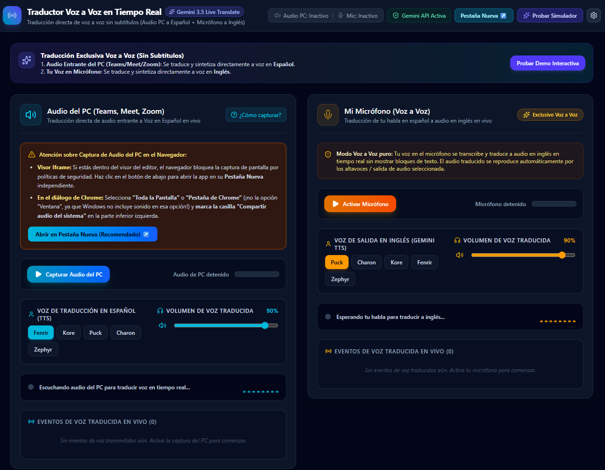

# Traductor Voz A Voz Con Gemini 3.5 Live Traslate

## 🇪🇸 Descripción (Español)
Este proyecto es una herramienta de traducción en tiempo real de voz a voz, diseñada principalmente para entrevistas de trabajo, el día a día laboral y para romper la barrera del idioma de forma fluida. Funciona a través de dos canales principales:

1. **Canal 1 (Traducción Externa):** Captura y traduce voz a voz el audio de la persona que habla al otro lado, ya sea en una videollamada, un video de YouTube o una conferencia. 
2. **Canal 2 (Micrófono Local):** Te permite hablar en tu idioma (español) a través del micrófono, y la persona al otro lado escuchará tu respuesta traducida al inglés.

---

## 🇬🇧 Description (English)
This project is a real-time voice-to-voice translation tool, designed primarily for job interviews, day-to-day work, and to seamlessly break the language barrier. It operates through two main channels:

1. **Channel 1 (External Translation):** Captures and translates voice-to-voice audio from the person speaking on the other side, whether in a video call, a YouTube video, or a conference.
2. **Channel 2 (Local Microphone):** Allows you to speak in your language (Spanish) through your microphone, and the person on the other side will hear your response translated into English.

---

## Autor / Author
Niklauss Quintero Nick: Alzheimeer

## Licencia / License
Este proyecto está bajo la licencia [MIT](LICENSE) - siéntete libre de usarlo. / This project is licensed under the [MIT](LICENSE) License - feel free to use it.
